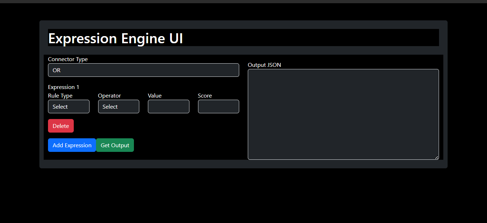

 # 🚀 Expression Engine UIA web-based Expression Engine UI created using React and Bootstrap, empowering users to define rules and conditions effortlessly.

 ## 🌐 Live Host Link

You can access the live hosted version of the Expression Engine UI at [https://expression-ui.vercel.app/](https://expression-ui.vercel.app/). 

## 🌟 Introduction

Expression Engine UI is a user-friendly web application that simplifies the definition of complex rules and expressions. The application provides a visually appealing interface using Bootstrap and is developed using the React library.

## ✨ Features

- **Dynamic Expression Management:** Add and delete expressions seamlessly.
- **Real-time JSON Output:** View the generated JSON output instantly.
- **Responsive Design:** Ensures a seamless experience across various devices.

## ⚙️ Technologies Used

- **React:** A JavaScript library for building user interfaces.
- **Bootstrap:** A popular CSS framework for responsive and visually appealing design.

## 📁 Project Structure

The project structure follows a modular approach:

- **`src/components/App.js`:** The main React component containing the logic for the Expression Engine UI.
- **`src/index.js`:** Entry point of the React application.

## 📸 Screenshots



## 🚦 Getting Started

### Prerequisites

- **Node.js:** Make sure Node.js is installed on your machine. You can download it from [https://nodejs.org/](https://nodejs.org/).

### 🛠️ Installation

1. **Clone the repository:**

```bash
git clone https://github.com/SahilPB11/Expression-UI.git
```

2. **Install dependencies:**

```bash
npm install
```

3. **Start the development server:**

```bash
npm start
```

4. **Open your browser and go to http://localhost:5173 to access the Expression Engine UI.**


